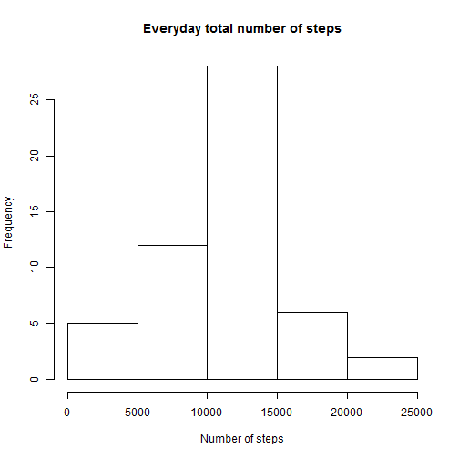
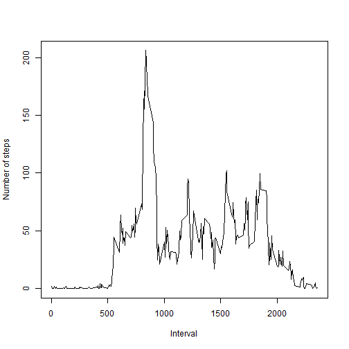
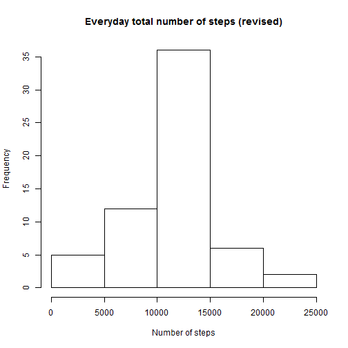

### Loading and preprocessing the data


```r
activityData = read.csv("activity.csv", colClasses = "character")
```

### What is mean total number of steps taken per day?


```r
dates = levels(as.factor(activityData[ , 2]))

dailySteps = data.frame()
for(i in 1:length(dates)) {
  ## shows the step data for each day
  steps = activityData[activityData[ , 2] == dates[i], ] 
  dailySteps[i, 1] = sum(as.numeric(steps[ , 1]))
  dailySteps[i, 2] = dates[i]
  }
```

Show the histogram

```r
hist(dailySteps[ , 1], main = "Everyday total number of steps", xlab = "Number of steps")
```



Calculate and report the mean and median

```r
## Ignore the NAs
completeData = dailySteps[complete.cases(dailySteps), ]

meanStep = mean(completeData[ , 1])
medianStep = median(completeData[ , 1])
```

Thus the mean and median step numbers are:

```r
print(meanStep)
```

```
## [1] 10766.19
```

```r
print(medianStep)
```

```
## [1] 10765
```

### What is the average daily activity pattern?


```r
activityData[ , 3] = as.numeric(activityData[ , 3])

intervalLevel = levels(as.factor(activityData[ , 3]))
intervals = as.numeric(intervalLevel)
```

Put the interval data in the order from smallest to largest

```r
intervals = intervals[order(intervals)]

meanIntervals = data.frame()
for(i in 1:length(intervals)) {
  meanIntervals[i, 1] = intervals[i]
  ## Calculate the mean of the steps in different intervals
  intervalSteps = activityData[activityData[ , 3] == intervals[i], ]
  intervalSteps = intervalSteps[complete.cases(intervalSteps), ]
  meanIntervals[i, 2] = mean(as.numeric(intervalSteps[ , 1]))
  }

plot(meanIntervals, type = "l", xlab = "Interval", ylab = "Number of steps")
```



Find which 5-minute interval contains the maximum number of steps

```r
maxStep = max(meanIntervals[ , 2])
maxInterval = meanIntervals[meanIntervals[ , 2] == maxStep, ]
print(maxInterval)
```

```
##      V1       V2
## 104 835 206.1698
```

### Imputing missing values

Impute missing values using the mean steps of each intervals

```r
## Calculate the number of NAs
## Load the data another time for calculation related to NAs
activityData1 = read.csv("activity.csv", colClasses = "character")
# Total number of missing values in the dataset
numNAs = sum(is.na(activityData1[ , 1]))
print(numNAs)
```

```
## [1] 2304
```

```r
## Impute missing values using the mean steps of each intervals
NARows = activityData1[!complete.cases(activityData1), ]
rowNum = as.numeric(rownames(NARows))

for(i in 1:length(rowNum)) {
  activityData1[rowNum[i], 1] = meanIntervals[meanIntervals[ , 1] == activityData1[rowNum[i], 3], 2]
  }

## Using the new dataset, find the mean and median again
dailySteps1 = data.frame()
for(i in 1:length(dates)) {
  steps1 = activityData1[activityData1[ , 2] == dates[i], ]
  dailySteps1[i, 1] = sum(as.numeric(steps1[ , 1]))
  dailySteps1[i, 2] = dates[i]
  }

## Show the new histogram and new mean and median
hist(dailySteps1[ , 1], main = "Everyday total number of steps (revised)", xlab = "Number of steps")
```



```r
meanStep1 = mean(dailySteps1[ , 1])
medianStep1 = median(dailySteps1[ , 1])

print(meanStep1)
```

```
## [1] 10766.19
```

```r
print(medianStep1)
```

```
## [1] 10766.19
```

The mean remains the same because I am using the mean value to replace the NAs. While the median becomes 10766.19

### Are there differences in activity patterns between weekdays and weekends?


```r
## Generate the 3rd column showing weekdays and weekends
weekDays = rep("weekday", 288*5)
weekEnds = rep("weekend", 288*2)
weekData = c(rep(c(weekDays, weekEnds), 8), weekDays)
activityData2 = cbind(activityData, weekData)

## The new dataset would be like this
head(activityData2)
```

```
##   steps       date interval weekData
## 1  <NA> 2012-10-01        0  weekday
## 2  <NA> 2012-10-01        5  weekday
## 3  <NA> 2012-10-01       10  weekday
## 4  <NA> 2012-10-01       15  weekday
## 5  <NA> 2012-10-01       20  weekday
## 6  <NA> 2012-10-01       25  weekday
```

```r
## Use the same method to calculate the mean number of steps in intervals of weekdays and weekends
activityWeekDays = activityData2[activityData2[ , 4] == "weekday", ]
intervalLevelWD = levels(as.factor(activityWeekDays[ , 3]))

activityWeekDays[ , 3] = as.numeric(activityWeekDays[ , 3])

intervalsWeekDays = as.numeric(intervalLevelWD)
intervalsWeekDays = intervalsWeekDays[order(intervalsWeekDays)]

meanIntervalsWD = data.frame()
for(i in 1:length(intervalsWeekDays)) {
  meanIntervalsWD[i, 1] = intervalsWeekDays[i]
  intervalSteps = activityWeekDays[activityWeekDays[ , 3] == intervalsWeekDays[i], ]
  intervalSteps = intervalSteps[complete.cases(intervalSteps), ]
  meanIntervalsWD[i, 2] = mean(as.numeric(intervalSteps[ , 1]))
  }

## For weekend data
activityWeekends = activityData2[activityData2[ , 4] == "weekend", ]
intervalLevelWE = levels(as.factor(activityWeekends[ , 3]))

activityWeekends[ , 3] = as.numeric(activityWeekends[ , 3])

intervalsWeekends = as.numeric(intervalLevelWE)
intervalsWeekends = intervalsWeekends[order(intervalsWeekends)]

meanIntervalsWE = data.frame()
for(i in 1:length(intervalsWeekends)) {
  meanIntervalsWE[i, 1] = intervalsWeekends[i]
  intervalSteps = activityWeekends[activityWeekends[ , 3] == intervalsWeekends[i], ]
  intervalSteps = intervalSteps[complete.cases(intervalSteps), ]
  meanIntervalsWE[i, 2] = mean(as.numeric(intervalSteps[ , 1]))
  }

## Show the panel graph
WD = cbind(meanIntervalsWD, "weekday")
WE = cbind(meanIntervalsWE, "weekend")

colnames(WD) = c("v1", "v2", "v3")
colnames(WE) = c("v1", "v2", "v3")
dd = rbind(WD, WE)
library(lattice)
xyplot(v2~ v1 | factor(v3), data = dd, type = "l", xlab = "Interval", ylab = "Number of steps", layout = c(1, 2))
```


